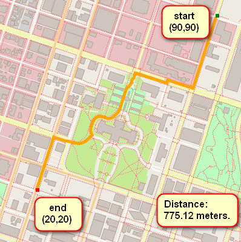

# Route Planning Project Starter Code

This is the starter code for the Route Planning project. Instructions for each exercise can be found in the `instructions` directory, and unit tests for some exercises in the `test` directory.

<div align=center></div>


## Cloning

When cloning this project, be sure to use the `--recurse-submodules` flag. Using HTTPS:
```
git clone https://github.com/udacity/CppND-Route-Planning-Project.git --recurse-submodules
```
or with SSH:
```
git clone git@github.com:udacity/CppND-Route-Planning-Project.git --recurse-submodules
```

## Dependencies

* cmake >= 3.11.3
 * All OSes: [click here for installation instructions](https://cmake.org/install/)
* make >= 4.1(mac, linux), 3.81(Windows)
  * Linux: make is installed by default on most Linux distros
* gcc/g++ >= 7.4.0
  * Linux: gcc / g++ is installed by default on most Linux distros
* [IO2D](https://github.com/cpp-io2d/P0267_RefImpl/blob/master/BUILDING.md)
    ```
    sudo apt update
    sudo apt install build-essential
    sudo apt install cmake
    sudo apt install libcairo2-dev
    sudo apt install libgraphicsmagick1-dev
    sudo apt install libpng-dev
    
    git clone --recurse-submodules https://github.com/cpp-io2d/P0267_RefImpl
    cd P0267_RefImpl
    mkdir Debug
    cd Debug
    cmake --config Debug "-DCMAKE_BUILD_TYPE=Debug" ..
    cmake --build .
    sudo make install
    ```


## Compiling and Running

### Compiling
To compile the project, first, create a `build` directory and change to that directory:
```
mkdir build && cd build
```
From within the `build` directory, then run `cmake` and `make` as follows:
```
cmake ..
make
```
### Running
The executables will be placed in the `bin` directory. From within `build`, you can run the project as follows:
```
../bin/<name-of-parent-directory> -f ../map.osm
```

## Testing

For exercises that have unit tests, the project must be built with the approprate test cpp file. This can be done by passing a string with the `-DTESTING` flag in `cmake`. For example, from the build directory:
```
cmake -DTESTING="RouteModel" ..
make
```
Those commands will build the code with the tests for the "Fill Out Route Model" exercise. The tests can then be run from the `build` directory as follows:
```
../bin/test
```
Exercises with tests will specify which string to pass with `-DTESTING`, but a table is given below with the complete list for reference:

| Exercise Name               | `-DTESTING` String Value |
|-----------------------------|:------------------------:|
| Fill Out Route Model        |       "RouteModel"       |
| Fill Out Node Class         |       "RMNodeClass"      |
| Create RouteModel Nodes     |        "RMSNodes"        |
| Write the Distance Function |        "NodeDist"        |
| Create Road to Node Hashmap |       "NodeToRoad"       |
| Write FindNeighbors         |      "FindNeighbors"     |
| Find the Closest Node       |       "FindClosest"      |
| Write the A\* Search Stub   |        "AStarStub"       |
| Finish A\* Search           |       "AStarSearch"      |

